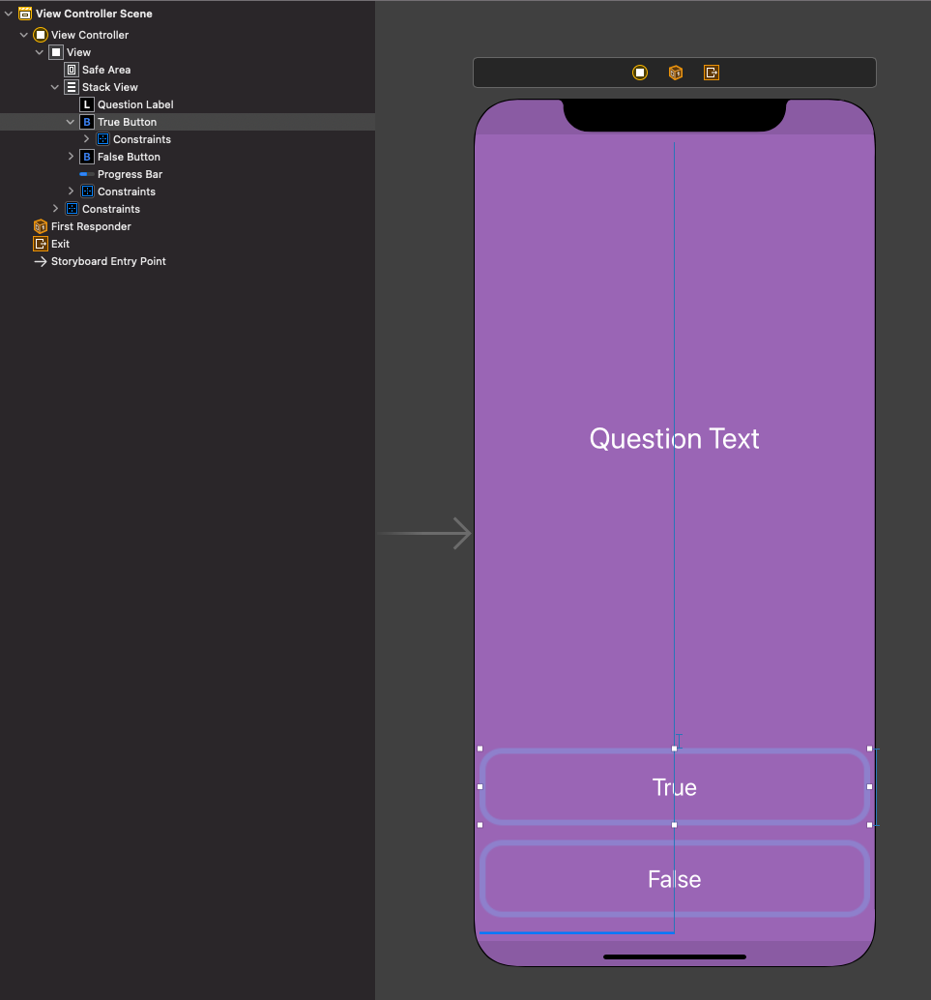

# Quiz-App-iOS
Quiz App written in Swift using UIKit

Planning better and introduced the MVC model into this app. 
User can select True or False to a hard coded set of questions. App includes progress bar and label that keeps track of score. 
User feedback with answer - button turns green if correct and red if incorrect.

## To Run App - 

1. Hit the green 'Code' button on this repo and copy the link to clone project
2. Load up xcode.
3. Under Source Control, click 'Clone'
4. Paste link into window and click 'Clone'
5. Navigate to where project is to be saved
6. Once opened, Run project and play!

### UI Design

### Gameplay

